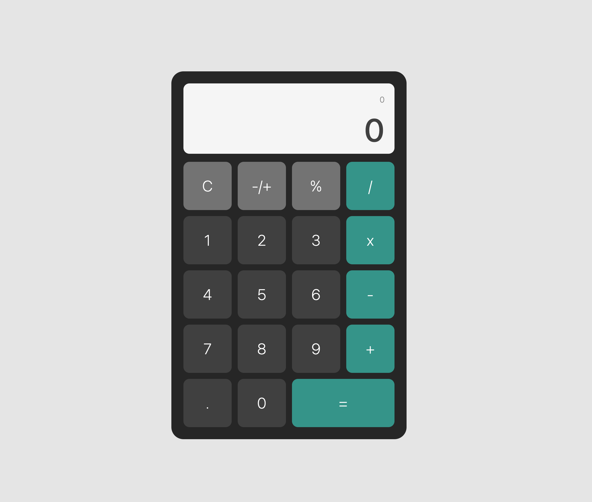

# Module 5 - Final Project - Calculator App

This is a my calculator app for the final project in module 5 of coursera course, Meta Front-end Development. The instruction is to build a simple calculator that demostrate 4 operations, but out of curiosity I jump to make a fully working real calculator app to challenge my understading to the course.

## Table of contents

- [Overview](#overview)
  - [The challenge](#the-challenge)
  - [Screenshot](#screenshot)
  - [Links](#links)
- [My process](#my-process)
  - [Built with](#built-with)
- [Author](#author)
- [Acknowledgments](#acknowledgments)

## Overview

### The challenge

- User can press the all the buttons.
- User can use the 4 operation (add,substract, multiply, divide) also to get the result/total you need to press the equal button.
- you can also press -/+ button to determine number if positive or negative.
- you can also add decimal point and decimal value.

### Screenshot

### Links

- Solution URL: [Github Repositories](https://github.com/weraldco/react-basic-calculator)
- Live Site URL: [Weather App Challenge from FrontendMentor](https://react-basic-calculator-sigma.vercel.app/)

## My process

I just first make all the button, then create a div area as container for the result and history of the previous operation. after building the UI, I work on functionality of every buttons.

### Built with

- Flexbox
- CSS Grid
- [React](https://reactjs.org/) - JS library
- Taiwind CSS
- Typescript

## Author

- Website - [wecoop website](https://wcoop.vercel.app)
- Github - [weraldco Github](https://github.com/weraldco)
- Frontend Mentor - [@yourusername](https://www.frontendmentor.io/profile/weraldco)

## Acknowledgments

This course take me to the deepest understanding of React, even though I have a knowledge in React, this course refresh me and add more learning and techniques, this is the best way to learn to be a beginner.
